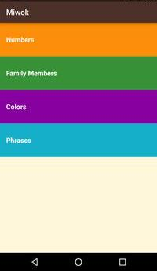
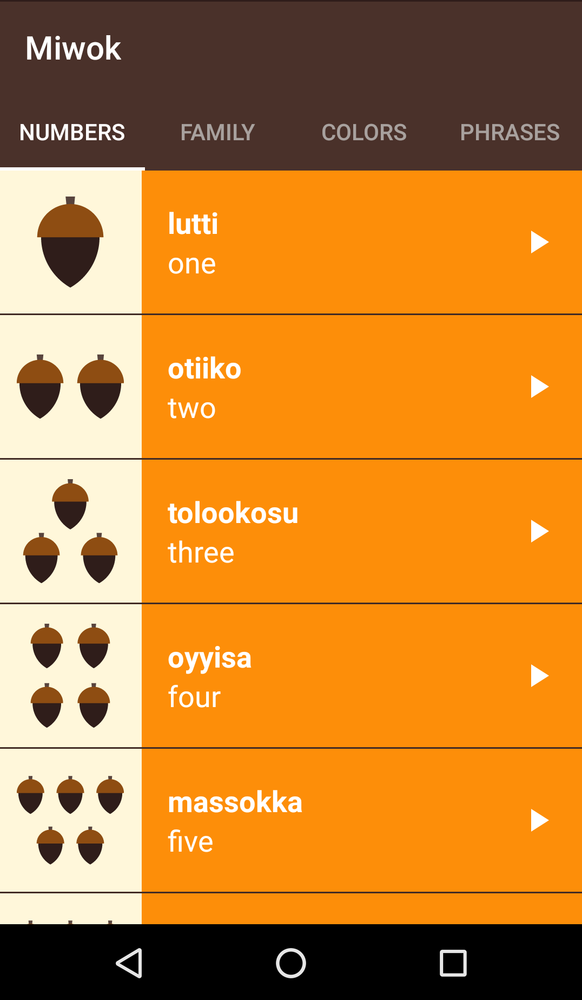
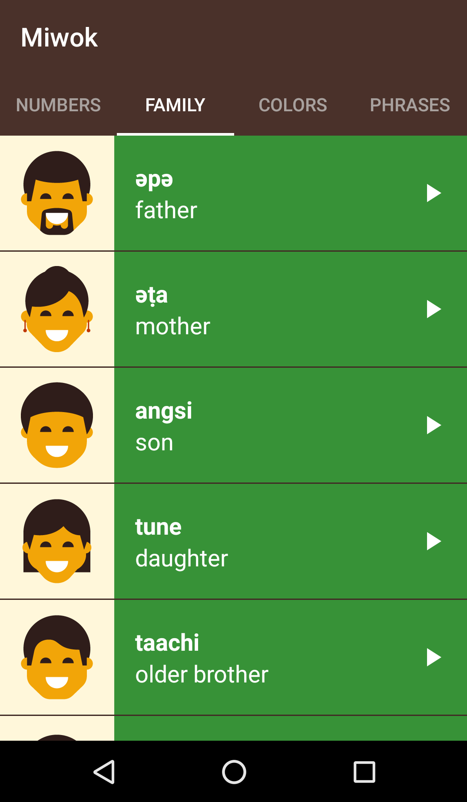
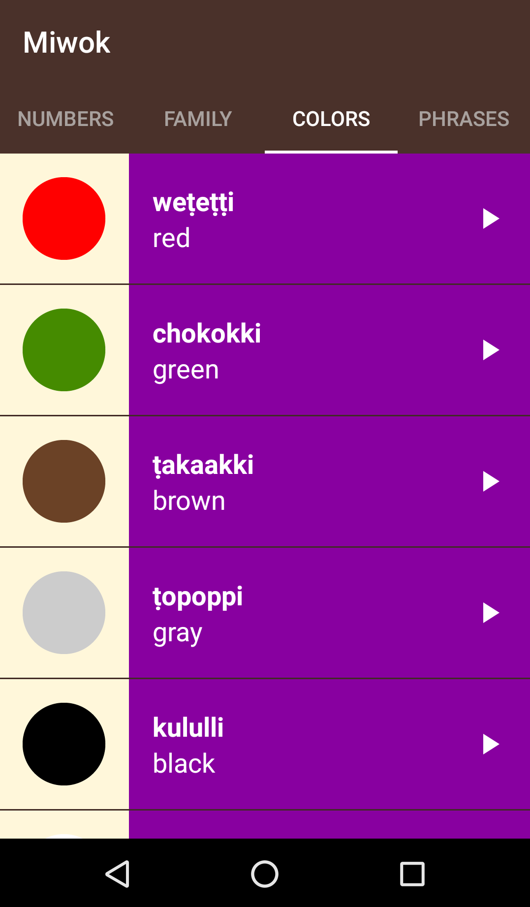
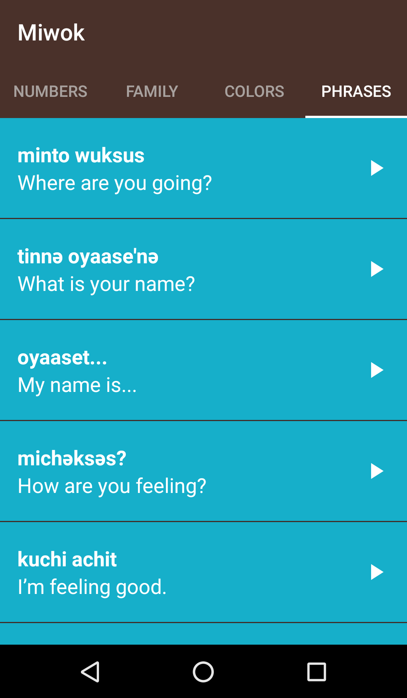

# Miwok-Language Android App

This app displays lists of vocabulary words for the user to learn the Miwok language. This is a project in a Udacity course in the Android Developer Nanodegree.

Miwok language is an endangered language which is sadly on the verge of extinction.

The app is built as an effort towards preserving the endangered language. It provides English to Miwok translations of common phrases and words using audio files.

The app uses Android’s Fragments, AudioManager, AudioFocus, MediaPlayer classes. It also provides visual feedback (ripple animation) when a button is clicked.

## Screenshots

